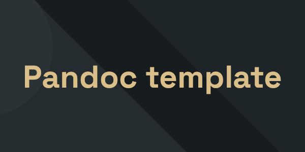

# LaTeX Report Template with Pandoc

This folder contains a LaTeX template for generating professional reports with Pandoc, along with a flexible Makefile to simplify compilation.

## 📁 Contents

- `template.tex` - Main LaTeX template
- `Makefile` - Compilation script with configurable options
- `img/` - Folder containing required images
  - `dark-background.png` - Background image for dark theme
  - `light-background.png` - Background image for light theme

## Exemple


## Installation

### Prerequisites

Make sure you have installed:

- **Pandoc** (version 2.0 or higher)
- **LuaLaTeX** (included in TeX Live or MiKTeX)
- **Make** (usually pre-installed on Linux/macOS)

### Quick Installation

```bash
# On Ubuntu/Debian
sudo apt install pandoc texlive-xetex make

# On Fedora
sudo dnf install pandoc texlive-xetex make

# On macOS with Homebrew
brew install pandoc
brew install --cask mactex
```

## Features

### Automatic Unicode Fallback

This template includes **automatic fallback** for Unicode characters missing in the Space Grotesk font (mathematical symbols, emojis, special characters, etc.).

- **LuaLaTeX (Recommended)**: Native automatic fallback - works for ALL Unicode characters
- **XeLaTeX**: Manual fallback via generated mappings

---

## Usage

### Basic Usage

Place your Markdown file at the same level as the Makefile (or directly modify document.md) and compile:

```bash
# Default compilation (light theme, PDF, with cover page and table of contents)
make

# Specify a source file
make INPUT=my-other-document.md

# Specify output name
make OUTPUT_NAME=final-report
```

### Available Options

The Makefile supports the following options, **all combinable**:

| Variable       | Values            | Default          | Description            |
| -------------- | ----------------- | ---------------- | ---------------------- |
| `THEME`        | `light` \| `dark` | `light`          | Document theme         |
| `FORMAT`       | `pdf` \| `tex`    | `pdf`            | Output format          |
| `COVER`        | `true` \| `false` | `true`           | Show cover page        |
| `TOC`          | `true` \| `false` | `true`           | Show table of contents |
| `INPUT`        | file path         | `document.md`    | Markdown source file   |
| `OUTPUT_NAME`  | file name         | `document`       | Output file name       |
| `BIBLIOGRAPHY` | file path         | `references.bib` | Bibliography file      |

### Usage Examples

#### Simple Examples

```bash
# Dark theme
make THEME=dark

# LaTeX output instead of PDF
make FORMAT=tex

# Without cover page
make COVER=false

# Without table of contents
make TOC=false
```

#### Option Combinations

| Variable       | Valeurs           | Défaut           | Description en français        |
| -------------- | ----------------- | ---------------- | ------------------------------ |
| `COVER`        | `true` \| `false` | `true`           | Afficher la page de garde      |
| `TOC`          | `true` \| `false` | `true`           | Afficher la table des matières |
| `INPUT`        | path of the file  | `document.md`    | Fichier source Markdown        |
| `OUTPUT_NAME`  | path of the file  | `document`       | Nom du fichier de sortie       |
| `BIBLIOGRAPHY` | path of the file  | `references.bib` | Fichier de bibliographie       |

### Exemples d'utilisation

#### Simple Examples

```bash
# Dark theme
make THEME=dark

# LaTeX output instead of PDF
make FORMAT=tex

# Without cover page
make COVER=false

# Without table of contents
make TOC=false
```

#### Option Combinations

```bash
# Dark theme in PDF
make THEME=dark FORMAT=pdf

# Dark theme without cover page
make THEME=dark COVER=false

# Light theme without table of contents
make THEME=light TOC=false

# Dark theme, without cover page or table of contents
make THEME=dark COVER=false TOC=false

# LaTeX output with dark theme
make THEME=dark FORMAT=tex

# Fully customized
make INPUT=report.md OUTPUT_NAME=final-report THEME=dark COVER=false TOC=false
```

#### Predefined Targets

For ease of use, some common combinations are available:

```bash
make dark-pdf              # Dark theme, PDF output
make light-pdf             # Light theme, PDF output
make dark-tex              # Dark theme, LaTeX output
make light-tex             # Light theme, LaTeX output
make dark-no-cover         # Dark theme without cover page
make light-no-toc          # Light theme without table of contents
make dark-no-cover-no-toc  # Dark theme without cover or toc
```

### Other Commands

```bash
# Show complete help
make help

# Clean generated files
make clean
```

## 📄 Structur of the Markdown file

Your markdown file must contain the folowing meta-data

```yaml
---
title: "The main title"
subtitle: "A nice subtitle"
author: "Name Surname"
institute: "University of ..."
lang: "fr"
theme: "light" # <-- thème clair : light | thème sombre : dark
no-cover-page: false # <-- Activer/désactiver la page de garde
no-toc: true # <-- Activer/désactiver la table des matières
fix-images: true # <-- Forcer les images à rester exactement à leur position
fontsize: 12pt
geometry: margin=2.5cm
# Optionnel : bibliographie
bibliography: references.bib
---
# Introduction

Your content here
```

### Supported metadata - English explanation

- `title` - Document title
- `author` - Author(s)
- `date` - Date
- `lang` - Document language (fr, en, es, etc.)
- `subtitle` - Subtitle (optional)
- `theme` - Visual theme: `light` or `dark`
- `no-cover-page` - Disable cover page (`true` to disable)
- `no-toc` - Disable table of contents (`true` to disable)
- `fix-images` - Force images to stay at their exact position (`true` to enable)
  - **`true`**: Images appear exactly where they are placed in the text (recommended for technical documents)
  - **`false`** or absent: LaTeX automatically positions images to optimize space
- `bibliography` - Bibliography file (optional)
- `abstract` - Document abstract (optional)

### Supported metadata - Explication en Français

- `title` - Titre du document
- `author` - Auteur(s)
- `date` - Date
- `lang` - Langue du document (fr, en, es, etc.)
- `subtitle` - Sous-titre (optionnel)
- `theme` - Thème visuel : `light` (clair) ou `dark` (sombre)
- `no-cover-page` - Désactiver la page de garde (`true` pour désactiver)
- `no-toc` - Désactiver la table des matières (`true` pour désactiver)
- `fix-images` - Forcer les images à rester à leur position exacte (`true` pour activer)
  - **`true`** : Les images apparaissent exactement où elles sont placées dans le texte (recommandé pour les documents techniques)
  - **`false`** ou absent : LaTeX positionne automatiquement les images pour optimiser l'espace
- `bibliography` - Fichier de bibliographie (optionnel)
- `abstract` - Résumé du document (optionnel)

## 📚 Bibliography

If your document contains citations, place a `references.bib` file at the same level as your Markdown file. The Makefile will automatically detect it and enable citation processing.

Example of a citation in Markdown:

```markdown
According to research [@smith2020], ...
```

## 📄 Licence

Copyright 2025 TristanGrlt

Permission is hereby granted, free of charge, to any person obtaining a copy of this software and associated documentation files (the “Software”), to deal in the Software without restriction, including without limitation the rights to use, copy, modify, merge, publish, distribute, sublicense, and/or sell copies of the Software, and to permit persons to whom the Software is furnished to do so, subject to the following conditions:

The above copyright notice and this permission notice shall be included in all copies or substantial portions of the Software.

THE SOFTWARE IS PROVIDED “AS IS”, WITHOUT WARRANTY OF ANY KIND, EXPRESS OR IMPLIED, INCLUDING BUT NOT LIMITED TO THE WARRANTIES OF MERCHANTABILITY, FITNESS FOR A PARTICULAR PURPOSE AND NONINFRINGEMENT. IN NO EVENT SHALL THE AUTHORS OR COPYRIGHT HOLDERS BE LIABLE FOR ANY CLAIM, DAMAGES OR OTHER LIABILITY, WHETHER IN AN ACTION OF CONTRACT, TORT OR OTHERWISE, ARISING FROM, OUT OF OR IN CONNECTION WITH THE SOFTWARE OR THE USE OR OTHER DEALINGS IN THE SOFTWARE.
